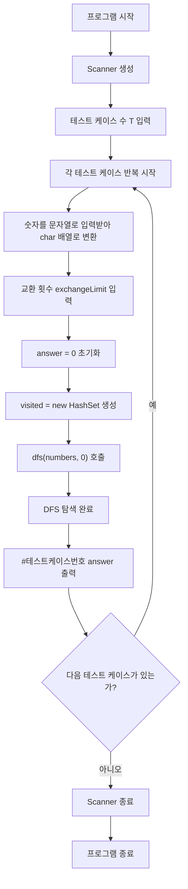
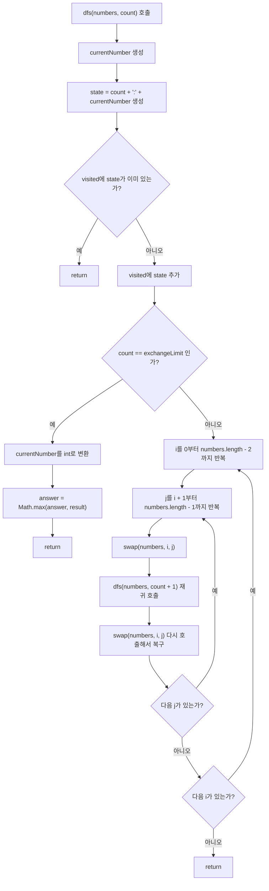
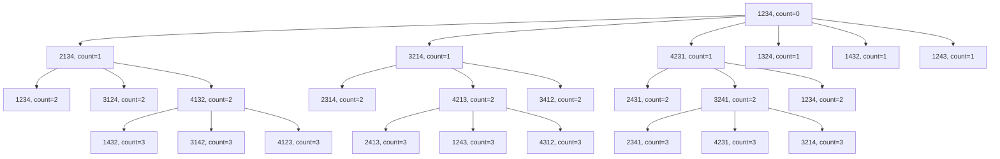

# DFS 숫자 교환 흐름

## main 흐름

```mermaid
flowchart TD
    A["프로그램 시작"] --> B["Scanner 생성"]
    B --> C["테스트 케이스 수 T 입력"]
    C --> D["각 테스트 케이스 반복 시작"]

    D --> E["숫자를 문자열로 입력받아 char 배열로 변환"]
    E --> F["교환 횟수 exchangeLimit 입력"]
    F --> G["answer = 0 초기화"]
    G --> H["visited = new HashSet 생성"]
    H --> I["dfs(numbers, 0) 호출"]

    I --> J["DFS 탐색 완료"]
    J --> K["#테스트케이스번호 answer 출력"]

    K --> L{"다음 테스트 케이스가 있는가?"}
    L -- "예" --> D
    L -- "아니오" --> M["Scanner 종료"]
    M --> N["프로그램 종료"]
```

## dfs 메서드 흐름

```mermaid
flowchart TD
    A["dfs(numbers, count) 호출"] --> B["currentNumber 생성"]
    B --> C["state = count + ':' + currentNumber 생성"]

    C --> D{"visited에 state가 이미 있는가?"}
    D -- "예" --> E["return"]
    D -- "아니오" --> F["visited에 state 추가"]

    F --> G{"count == exchangeLimit 인가?"}
    G -- "예" --> H["currentNumber를 int로 변환"]
    H --> I["answer = Math.max(answer, result)"]
    I --> J["return"]

    G -- "아니오" --> K["i를 0부터 numbers.length - 2까지 반복"]
    K --> L["j를 i + 1부터 numbers.length - 1까지 반복"]
    L --> M["swap(numbers, i, j)"]
    M --> N["dfs(numbers, count + 1) 재귀 호출"]
    N --> O["swap(numbers, i, j) 다시 호출해서 복구"]
    O --> P{"다음 j가 있는가?"}
    P -- "예" --> L
    P -- "아니오" --> Q{"다음 i가 있는가?"}
    Q -- "예" --> K
    Q -- "아니오" --> R["return"]
```

## 예시 탐색 흐름: 1234, 교환 횟수 3

```mermaid
graph TD
    A["1234, count=0"] --> B["2134, count=1"]
    A --> C["3214, count=1"]
    A --> D["4231, count=1"]
    A --> E["1324, count=1"]
    A --> F["1432, count=1"]
    A --> G["1243, count=1"]

    B --> H["1234, count=2"]
    B --> I["3124, count=2"]
    B --> J["4132, count=2"]

    C --> K["2314, count=2"]
    C --> L["4213, count=2"]
    C --> M["3412, count=2"]

    D --> N["2431, count=2"]
    D --> O["3241, count=2"]
    D --> P["1234, count=2"]

    J --> Q["1432, count=3"]
    J --> R["3142, count=3"]
    J --> S["4123, count=3"]

    L --> T["2413, count=3"]
    L --> U["1243, count=3"]
    L --> V["4312, count=3"]

    O --> W["2341, count=3"]
    O --> X["4231, count=3"]
    O --> Y["3214, count=3"]
```
