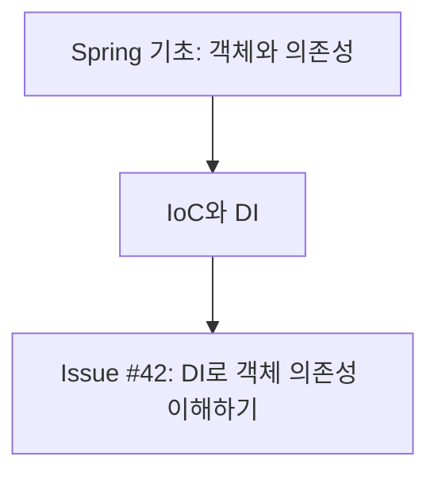

# Diary

Turn the user's learning into durable, topic-focused GitHub Issues with their meaningful work prompts, a README learning index, and matching Notion CodingStudy calendar entries. Treat the conversation as the primary evidence of what the user actually studied.

## Source of Truth

1. Read the current conversation and any text after `$diary` first. Use it as the authoritative learning evidence.
2. Use explicit user notes, prompts, commands, exercises, and repository changes only to support or clarify that evidence. Do not create a `수정한 파일` section and do not treat a changed file as proof of learning by itself.
3. Never present an inferred or advanced topic as something the user completed. Label it as additional learning material.
4. If no study topic is supported by the conversation or the user's notes, ask for study notes rather than inventing an Issue.

## Workflow

1. Determine the local date, preferring Asia/Seoul when it is available.
2. Read the conversation, `$diary` trailing text, and any user-provided study notes. Collect concrete evidence such as the concept discussed, a question asked, an exercise attempted, a conclusion reached, and the meaningful prompts that directed the work.
3. Optionally inspect the current repository with `git status`, `git log`, and a targeted diff when it helps verify an exercise. Do not include a file-change inventory in the Issue body.
4. Split the learning into independent, stable subjects. Create exactly one Issue per subject in the current diary run.
   - For example, Java + Spring + HTML produces three Issues, not one combined Issue.
   - Keep dependent detail in its parent subject: Spring DI and Spring IoC belong in `spring`, not separate `di` and `ioc` Issues.
   - Use a specific subject only when it is genuinely independent and likely to recur, such as `jpa`, `thymeleaf`, or `sql`.
5. For each subject, choose exactly one lower-case GitHub label (for example `java`, `spring`, `html`, `jpa`, or `testing`). List repository labels first; reuse a matching label or create the missing label with a short Korean description.
6. Give each Issue a title that exposes both the subject and the overall learning outcome:

   ```text
   [Spring] 2026-07-25 — IoC와 DI로 객체 의존성 이해하기
   ```

   - Use the human-readable subject in the bracket and the exact label in GitHub metadata.
   - Replace the example's date and outcome with the current subject's actual content.
   - Avoid vague titles such as `Spring 공부` or a title that combines unrelated subjects.
7. Write a Korean Issue body using the template below. Keep it concise and factual. Add one `심화 확장` section with useful next-level context that builds naturally on the topic.
   - Draw advanced material from stable knowledge or authoritative documentation when current behavior, versions, or library APIs matter.
   - Explain why the advanced material matters, but clearly mark it as a next step rather than evidence of completed learning.
8. Create each Issue with its one subject label. If GitHub Issue creation is unavailable, return every exact title, label, and body as a draft; do not claim an Issue was created.
9. After creation, inspect earlier open and closed learning Issues with each created subject label. Build and return a Mermaid learning map for each subject that connects the new Issue to verified prior Issue concepts. If no earlier Issue exists, show the new Issue as the starting node.
10. After every successfully published Issue, update the MyDiary repository's `README.md` learning index as described below. Do not update it for drafts or failed Issue publication.
11. After every successfully published Issue, add a matching page to the Notion CodingStudy calendar as described below. A Notion failure must not undo or conceal a successful GitHub publication; report the two outcomes separately.

## Issue Body Template

```md
## 오늘의 주제
- {subject}

## 오늘 공부한 내용
- {conversation and note evidence, organized as concepts or outcomes}

## 대화에서 확인한 학습 근거
- {brief paraphrase of a user question, note, exercise, or conclusion}

## 사용한 프롬프트
- {the user's meaningful prompt that requested the learning or work}

## 핵심 정리
- {the most important concept, distinction, or pitfall}

## 심화 확장
- {advanced next step}: {why it follows from today's topic and what to study next}

## 다음 학습
- {one or two concrete next actions}
```

- Include `## 사용한 프롬프트` with the user's direct, meaningful prompts from this learning run. Preserve the Korean wording when practical; for a long prompt, shorten only background detail while preserving the requested action.
- Include the `$diary` prompt when it contains learning notes or an explicit instruction.
- Do not include assistant messages, tool commands, internal reasoning, or unrelated conversational remarks as prompts.
- Do not add `## 수정한 파일` or a raw diff.
- Do not include unrelated repository work simply because it happened on the same date.
- Use actual user wording only when a short quote preserves an important distinction; otherwise paraphrase it.

## GitHub Issue Handling

1. Confirm that `gh` is available, authenticated, and points to the intended repository. If it cannot be confirmed, provide drafts instead of publishing.
2. List existing labels before creating any. Create only the missing stable subject labels.
3. Create one Issue per subject with one `--label` argument. Do not attach incidental labels such as `diary` or `study` unless the user explicitly requests them.
4. Create a fresh Issue for each `$diary` run. Do not merge different study sessions merely because the date and label match. Link related earlier Issues in the learning map instead.
5. Report each created Issue number, URL, title, and label.

## README Issue Index

After successful Issue publication, add its GitHub Issue link to the README learning index.

1. Keep the repository's existing documents and unrelated README sections intact.
2. Update only the content between these markers in `README.md`; create the marker block under `## 학습 Issue 목록` when it does not exist.

   ```md
   <!-- diary-index:start -->
   <!-- diary-index:end -->
   ```

3. Add one Markdown bullet under the matching human-readable subject heading: `- [#{issue number} — {Issue title without bracketed subject and date}](Issue URL)`.
4. Create a subject heading only when it does not exist. Keep new entries at the top of that subject's list.
5. Make the README update idempotent. If the Issue URL is already present in the marker block, do not add a duplicate.
6. Keep only Issue links in this marker block. Do not add summaries, Obsidian wiki links, Mermaid diagrams, prompts, or repository change inventories unless the user specifically asks for them.
7. If the repository is unavailable or the Issue was only drafted, leave `README.md` unchanged and explain why.

## Notion CodingStudy Calendar

After each successful Issue publication, create one matching calendar page in the connected Notion workspace.

1. Target the `CodingStudy` database under the `Coding` page:
   - Database ID: `39ae65da-cd3d-8072-87eb-dad6ef5a8fd2`
   - Data source ID: `collection://39ae65da-cd3d-808d-8c54-000b321a131a`
   - Calendar view: `캘린더(날짜) 보기`
2. Fetch the database before writing and confirm that it is still named `CodingStudy`, its parent is `Coding`, and the required properties still exist. Do not create a replacement database or alter its schema when validation fails.
3. Before creating a page, query or search the data source for the same `원문 링크`. If a page already has that Issue URL, update missing or stale mapped properties instead of creating a duplicate.
4. Map the published Issue to these properties:
   - `이름`: the exact GitHub Issue title
   - `date:날짜:start`: the diary run's Asia/Seoul date in `YYYY-MM-DD`
   - `date:날짜:is_datetime`: `0`
   - `분석 종류`: `회고`
   - `요약`: one concise Korean sentence stating the subject's main learning outcome
   - `원문 링크`: the GitHub Issue URL
   - `태그`: set only existing matching options; for example, use `["Java"]` for a Java subject. Omit it when no existing option matches, and never change the database schema merely to add a tag.
5. Keep the Notion page body empty unless the user explicitly asks to copy the full study note into Notion. The GitHub Issue remains the source document.
6. If Notion is unavailable or disconnected, do not claim the page was created. Preserve the GitHub result and provide the exact title and properties as a Notion draft.
7. Report the created or updated Notion page URL for every published subject.

## Learning Map

After publishing all Issues, query prior open and closed Issues for each created label. Read their titles and relevant learning sections to infer only well-supported prerequisite or follow-up relationships.

Return one Mermaid `flowchart TD` per subject in the final response:



- Use nodes and directed edges to show the hierarchy: verified prior Issue concept → current Issue → next concept.
- Put issue numbers in nodes when available. Keep node labels short and use the Issue URL in the surrounding Markdown list, because GitHub Mermaid diagrams should not rely on interactive links.
- Include only relationships supported by Issue content or the user's current notes. Do not add generic prerequisite nodes merely because they seem likely. If the relationship is an inference, state that below the diagram.
- Keep separate subjects in separate diagrams; never draw artificial edges between `java`, `spring`, and `html` merely because they were studied on the same day.

## Command Handling

- Treat bare `$diary` as: derive subjects from the conversation, create one Issue per subject with the meaningful user prompts, add its GitHub link to the README Issue index and a matching page to the Notion CodingStudy calendar for every published Issue, then return the labelled learning maps.
- Treat `$diary <text>` as: use `<text>` as additional primary evidence and combine it with the conversation.
- If the user asks for drafts, preview the topic split, Issue drafts, and maps without publishing. When earlier Issues cannot be read, start each map with the current draft node and connect only to an explicitly stated next concept.
