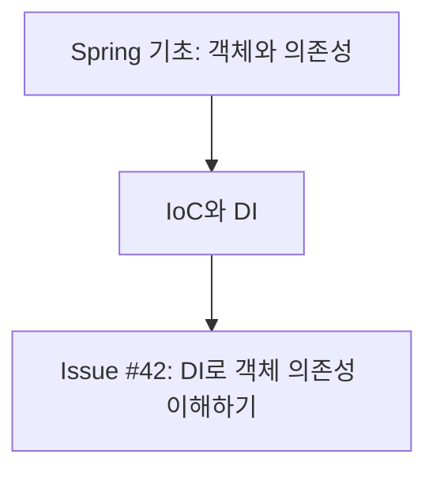

# Diary

Turn the user's learning into durable, topic-focused GitHub Issues with their meaningful work prompts, a README learning index, and detailed subject-tagged review documents in the Notion CodingStudy calendar. Treat the conversation as the primary evidence of what the user actually studied.

## Source of Truth

1. Read the current conversation and any text after `$diary` first. Use it as the authoritative learning evidence.
2. Use explicit user notes, prompts, commands, exercises, and repository changes only to support or clarify that evidence. Do not create a `수정한 파일` section and do not treat a changed file as proof of learning by itself.
3. Never present an inferred or advanced topic as something the user completed. Label it as additional learning material.
4. If no study topic is supported by the conversation or the user's notes, ask for study notes rather than inventing an Issue.

## Workflow

1. Determine the local date, preferring Asia/Seoul when it is available.
2. Read the conversation, `$diary` trailing text, and any user-provided study notes. Collect concrete evidence such as the concept discussed, a question asked, an exercise attempted, a conclusion reached, and the meaningful prompts that directed the work.
3. Optionally inspect the current repository with `git status`, `git log`, and a targeted diff when it helps verify an exercise. Do not include a file-change inventory in the Issue body.
4. Split the learning into independent, stable subjects. Produce exactly one Issue record per subject in the current diary run, either by updating the matching daily Issue or creating one when absent.
   - For example, Java + Spring + HTML produces three Issues, not one combined Issue.
   - Keep dependent detail in its parent subject: Spring DI and Spring IoC belong in `spring`, not separate `di` and `ioc` Issues.
   - Use a specific subject only when it is genuinely independent and likely to recur, such as `jpa`, `thymeleaf`, or `sql`.
5. For each subject, choose exactly one lower-case GitHub label (for example `java`, `spring`, `html`, `jpa`, or `testing`). List repository labels first; reuse a matching label or create the missing label with a short Korean description.
6. Before writing, inspect all open and closed Issues with the exact subject label. If an Issue already represents the same Asia/Seoul date and label, update that Issue instead of creating another one. If multiple matches already exist, use the most recently updated Issue as the canonical daily record, report the duplicates, and do not create or close an Issue automatically.
7. Give each Issue a title that exposes both the subject and the overall learning outcome:

   ```text
   [Spring] 2026-07-25 — IoC와 DI로 객체 의존성 이해하기
   ```

   - Use the human-readable subject in the bracket and the exact label in GitHub metadata.
   - Replace the example's date and outcome with the current subject's actual content.
   - Avoid vague titles such as `Spring 공부` or a title that combines unrelated subjects.
8. Write a Korean Issue body using the template below. Keep it concise and factual. Add one `심화 확장` section with useful next-level context that builds naturally on the topic.
   - Draw advanced material from stable knowledge or authoritative documentation when current behavior, versions, or library APIs matter.
   - Explain why the advanced material matters, but clearly mark it as a next step rather than evidence of completed learning.
9. Publish each subject with its one label. Update the canonical same-date Issue when one exists; create a new Issue only when none exists. When updating, preserve earlier verified content and prompts, merge new evidence into the matching sections, remove exact or near-duplicate bullets, and widen the title outcome only when the combined learning requires it. If GitHub publication is unavailable, return every exact title, label, and body as a draft; do not claim an Issue was created or updated.
10. After publication, inspect earlier open and closed learning Issues with each subject label. Build and return a Mermaid learning map that connects the current daily Issue to verified prior Issue concepts. If no earlier Issue exists, show the current Issue as the starting node.
11. After every successfully created or updated Issue, add or synchronize its link in the MyDiary repository's `README.md` learning index as described below. Do not update it for drafts or failed publication.
12. After every successfully created or updated Issue, add or update a matching page in the Notion CodingStudy calendar, classify it with the exact study-subject tag, and write a detailed, review-focused learning document as described below. Do not copy the Issue workflow template verbatim. A Notion failure must not undo or conceal a successful GitHub publication; report the two outcomes separately.

## Issue Body Template

```md
## 오늘의 주제
- {subject}

## 오늘 공부한 내용
- {conversation and note evidence, organized as concepts or outcomes}

## 대화에서 확인한 학습 근거
- {brief paraphrase of a user question, note, exercise, or conclusion}

## 사용한 프롬프트
- {the user's meaningful prompt that requested the learning or work}

## 핵심 정리
- {the most important concept, distinction, or pitfall}

## 심화 확장
- {advanced next step}: {why it follows from today's topic and what to study next}

## 다음 학습
- {one or two concrete next actions}
```

- Include `## 사용한 프롬프트` with the user's direct, meaningful prompts from this learning run. Preserve the Korean wording when practical; for a long prompt, shorten only background detail while preserving the requested action.
- Include the `$diary` prompt when it contains learning notes or an explicit instruction.
- Do not include assistant messages, tool commands, internal reasoning, or unrelated conversational remarks as prompts.
- Do not add `## 수정한 파일` or a raw diff.
- Do not include unrelated repository work simply because it happened on the same date.
- Use actual user wording only when a short quote preserves an important distinction; otherwise paraphrase it.

## GitHub Issue Handling

1. Confirm that `gh` is available, authenticated, and points to the intended repository. If it cannot be confirmed, provide drafts instead of publishing.
2. List existing labels before creating any. Create only the missing stable subject labels.
3. Use exactly one subject label. Do not attach incidental labels such as `diary` or `study` unless the user explicitly requests them.
4. Before publication, query open and closed Issues with the exact label and compare the date in each title with the current Asia/Seoul date.
5. If a same-date, same-label Issue exists, fetch its full title and body and update it in place:
   - Preserve all earlier verified learning content and meaningful prompts.
   - Merge new material into the existing template sections instead of appending a second full template.
   - Deduplicate repeated concepts, evidence, prompts, and next actions.
   - Keep the bracketed subject and date stable; revise only the outcome phrase when needed to represent the combined record.
   - Never overwrite user-authored material that is unrelated to the synchronized diary sections.
6. If multiple same-date, same-label Issues exist, select the most recently updated one as the canonical target, report the other matching Issue numbers, and do not create, close, or merge them automatically.
7. Create a new Issue only when no same-date, same-label Issue exists.
8. Report whether each Issue was created or updated, followed by its number, URL, title, and label.

## README Issue Index

After successful Issue creation or update, add or synchronize its GitHub Issue link in the README learning index.

1. Keep the repository's existing documents and unrelated README sections intact.
2. Update only the content between these markers in `README.md`; create the marker block under `## 학습 Issue 목록` when it does not exist.

   ```md
   <!-- diary-index:start -->
   <!-- diary-index:end -->
   ```

3. Add one Markdown bullet under the matching human-readable subject heading: `- [#{issue number} — {Issue title without bracketed subject and date}](Issue URL)`. If the URL already exists but the Issue title changed, update that bullet's text in place.
4. Create a subject heading only when it does not exist. Keep new entries at the top of that subject's list.
5. Make the README update idempotent. If the Issue URL is already present in the marker block, do not add a duplicate; synchronize only stale link text when necessary.
6. Keep only Issue links in this marker block. Do not add summaries, Obsidian wiki links, Mermaid diagrams, prompts, or repository change inventories unless the user specifically asks for them.
7. If the repository is unavailable or the Issue was only drafted, leave `README.md` unchanged and explain why.

## Notion CodingStudy Calendar

After each successful Issue creation or update, create or update one matching calendar page in the connected Notion workspace.

1. Target the `CodingStudy` database under the `Coding` page:
   - Database ID: `39ae65da-cd3d-8072-87eb-dad6ef5a8fd2`
   - Data source ID: `collection://39ae65da-cd3d-808d-8c54-000b321a131a`
   - Calendar view: `캘린더(날짜) 보기`
2. Fetch the database before writing and confirm that it is still named `CodingStudy`, its parent is `Coding`, and the required properties still exist. Do not create a replacement database or alter its schema when validation fails.
3. Before creating a page, query or search the data source for the same `원문 링크`. If a page already has that Issue URL, update missing or stale mapped properties and synchronize the study-note body instead of creating a duplicate.
4. Map the published Issue to these properties:
   - `이름`: the GitHub Issue title with the date segment removed. For example, map `[Spring] 2026-08-04 — IoC와 DI로 객체 의존성 이해하기` to `[Spring] IoC와 DI로 객체 의존성 이해하기`.
   - `date:날짜:start`: the diary run's Asia/Seoul date in `YYYY-MM-DD`
   - `date:날짜:is_datetime`: `0`
   - `요약`: one concise Korean sentence stating the subject's main learning outcome
   - `원문 링크`: the GitHub Issue URL
   - `태그`: exactly one human-readable study-subject option derived from the bracketed Issue subject, such as `["SQL"]`, `["CS"]`, `["Java"]`, `["Spring"]`, `["JPA"]`, or `["AI"]`
5. Keep the date only in the `날짜` property so the page appears on the correct calendar date. Never repeat the date in the Notion page title.
6. Use only the subject in `태그`. Never add generic workflow or document-type values such as `개념정리`, `회고`, `학습`, or `diary`, and do not set or synchronize `분석 종류` as part of the diary workflow.
7. Ensure the subject tag exists before creating or updating the page:
   - Match existing tag options case-insensitively and reuse their exact stored spelling when the subject is already present.
   - Otherwise add the bracketed human-readable subject as a new `태그` multi-select option. Preserve every existing option and its color; never drop, rename, or repurpose unrelated options while adding the subject.
   - If the schema tool requires redefining the complete multi-select option list, reconstruct all current options unchanged and append only the new subject option. If safe preservation cannot be guaranteed, do not modify the schema or page; report the Notion result as a draft with the required tag.
   - Existing diary pages found by `원문 링크` must replace stale generic or multi-value `태그` values with exactly the current subject tag, while leaving `분석 종류` unchanged.
8. Write a dedicated Korean review document instead of copying the GitHub Issue body verbatim. Expand only verified studied material from the conversation and Issue. For programming or other code-based learning, explain the concept in prose and place relevant code directly beside that explanation:

   ````md
   ## 학습 개요
   {무엇을 공부했고 개념들이 어떻게 연결되는지 설명}

   ## 개념 설명
   ### {개념 이름}
   {정의, 작동 원리, 필요한 이유를 완전한 문장으로 자세히 설명}

   #### 코드로 확인하기
   ```{language}
   {사용자가 다룬 내용을 보여 주는 최소한의 실행 가능한 코드}
   ```

   {입력값이 어떤 객체가 되고, 각 줄이 어떤 순서로 실행되며, 결과나 오류가 왜 발생하는지 해설}

   ## 예시와 적용
   {사용자가 다룬 코드, 명령, 연습 또는 오류를 완성된 예제로 구성하고 실행 흐름과 결과를 설명}

   ## 헷갈리기 쉬운 점
   {대화에서 구분한 유사 개념, 오해, 주의점}

   ## 핵심 복습
   - {나중에 다시 읽었을 때 기억해야 할 핵심}
   ````

   - Do not merely expand each Issue bullet with filler or produce a catalog of definitions. Build a connected explanation that answers what the concept is, why it behaves that way, how it relates to the surrounding concepts, and when it is used.
   - When the verified learning contains programming code, include at least one fenced code block for every materially different major concept group. Keep trivial variations together instead of creating repetitive snippets.
   - Introduce every code block with the idea it demonstrates. After the block, walk through the important lines in execution order and state the expected result or error. Never leave a code block unexplained.
   - Prefer minimal, executable examples based on the user's own exercise. Correct syntax and naming mistakes while explicitly explaining the original mistake and why the correction works.
   - Use the language identifier on fenced blocks, such as `python`, `java`, `sql`, `javascript`, or `bash`. Include sample output only when it materially helps understanding, and distinguish output from source code.
   - Connect code to the conceptual model. For example, do not only show `response.json()`; explain that the method parses the response body and creates Python `list` and `dict` objects that subsequent indexing operates on.
   - For a conceptual topic without meaningful code, use a concrete scenario, command, request/response example, table, or execution trace instead of inventing irrelevant code.
   - Keep the final `핵심 복습` short. Put the teaching detail in the prose, code, and walkthrough sections rather than hiding the explanation in a long bullet list.
   - Include only material supported by the conversation, user notes, exercises, or published Issue. Do not turn inferred advanced material into completed learning.
   - Omit workflow sections such as `대화에서 확인한 학습 근거`, `사용한 프롬프트`, `심화 확장`, and `다음 학습` unless the user explicitly asks for them in Notion.
   - Preserve useful headings, lists, and code blocks with supported Notion Markdown. For code-based study, a page that contains only prose, only code, or a list of concepts is incomplete unless the user explicitly requests that format.
   - Keep `원문 링크` as a separate provenance property; never use the URL as the page body or create a link-only body.
   - Before updating an existing page, fetch its body. Synchronize the review sections without duplicating them and never delete user-authored blocks. For a legacy page containing an exact AI-synchronized Issue copy, replace only that synchronized copy when it can be identified confidently; otherwise preserve it and add or update one `복습 정리` section.
   - Leave the page body empty or summary-only only when the user explicitly requests it. The GitHub Issue is the source record and Notion is the detailed review document.
9. If Notion is unavailable or disconnected, do not claim the page was created. Preserve the GitHub result and provide the exact date-free Notion title, subject tag, and properties as a Notion draft.
10. Report the created or updated Notion page URL and applied subject tag for every published subject.

## Learning Map

After publishing all current Issue records, query prior open and closed Issues for each subject label. Read their titles and relevant learning sections to infer only well-supported prerequisite or follow-up relationships.

Return one Mermaid `flowchart TD` per subject in the final response:



- Use nodes and directed edges to show the hierarchy: verified prior Issue concept → current Issue → next concept.
- Put issue numbers in nodes when available. Keep node labels short and use the Issue URL in the surrounding Markdown list, because GitHub Mermaid diagrams should not rely on interactive links.
- Include only relationships supported by Issue content or the user's current notes. Do not add generic prerequisite nodes merely because they seem likely. If the relationship is an inference, state that below the diagram.
- Keep separate subjects in separate diagrams; never draw artificial edges between `java`, `spring`, and `html` merely because they were studied on the same day.

## Command Handling

- Treat bare `$diary` as: derive subjects from the conversation, create or update the same-date Issue for each subject with the meaningful user prompts, add or synchronize its GitHub link in the README Issue index, write a detailed subject-tagged review document in a matching Notion CodingStudy page, then return the labelled learning maps.
- Treat `$diary <text>` as: use `<text>` as additional primary evidence and combine it with the conversation.
- If the user asks for drafts, preview the topic split, Issue drafts, and maps without publishing. When earlier Issues cannot be read, start each map with the current draft node and connect only to an explicitly stated next concept.
