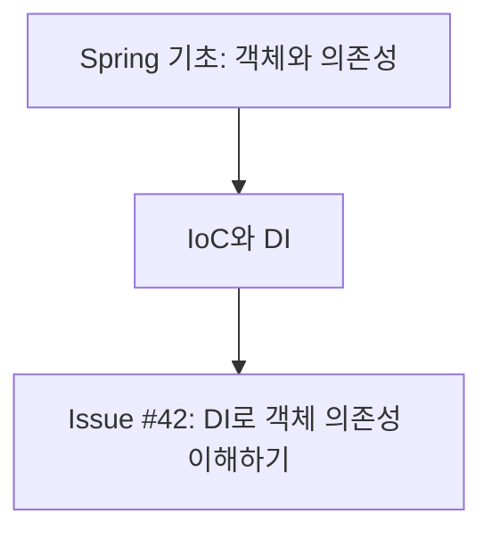

# Diary

Turn the user's learning into durable, topic-focused GitHub Issues, connected Obsidian graph notes, and an Obsidian-ready README index. Treat the conversation as the primary evidence of what the user actually studied.

## Source of Truth

1. Read the current conversation and any text after `$diary` first. Use it as the authoritative learning evidence.
2. Use explicit user notes, commands, exercises, and repository changes only to support or clarify that evidence. Do not create a `수정한 파일` section and do not treat a changed file as proof of learning by itself.
3. Never present an inferred or advanced topic as something the user completed. Label it as additional learning material.
4. If no study topic is supported by the conversation or the user's notes, ask for study notes rather than inventing an Issue.

## Workflow

1. Determine the local date, preferring Asia/Seoul when it is available.
2. Read the conversation, `$diary` trailing text, and any user-provided study notes. Collect concrete evidence such as the concept discussed, a question asked, an exercise attempted, or a conclusion reached.
3. Optionally inspect the current repository with `git status`, `git log`, and a targeted diff when it helps verify an exercise. Do not include a file-change inventory in the Issue body.
4. Split the learning into independent, stable subjects. Create exactly one Issue per subject in the current diary run.
   - For example, Java + Spring + HTML produces three Issues, not one combined Issue.
   - Keep dependent detail in its parent subject: Spring DI and Spring IoC belong in `spring`, not separate `di` and `ioc` Issues.
   - Use a specific subject only when it is genuinely independent and likely to recur, such as `jpa`, `thymeleaf`, or `sql`.
5. For each subject, choose exactly one lower-case GitHub label (for example `java`, `spring`, `html`, `jpa`, or `testing`). List repository labels first; reuse a matching label or create the missing label with a short Korean description.
6. Give each Issue a title that exposes both the subject and the overall learning outcome:

   ```text
   [Spring] 2026-07-25 — IoC와 DI로 객체 의존성 이해하기
   ```

   - Use the human-readable subject in the bracket and the exact label in GitHub metadata.
   - Replace the example's date and outcome with the current subject's actual content.
   - Avoid vague titles such as `Spring 공부` or a title that combines unrelated subjects.
7. Write a Korean Issue body using the template below. Keep it concise and factual. Add one `심화 확장` section with useful next-level context that builds naturally on the topic.
   - Draw advanced material from stable knowledge or authoritative documentation when current behavior, versions, or library APIs matter.
   - Explain why the advanced material matters, but clearly mark it as a next step rather than evidence of completed learning.
8. Create each Issue with its one subject label. If GitHub Issue creation is unavailable, return every exact title, label, and body as a draft; do not claim an Issue was created.
9. After creation, inspect earlier open and closed learning Issues with each created subject label. Build and return a Mermaid learning map for each subject that connects the new Issue to verified prior Issue concepts. If no earlier Issue exists, show the new Issue as the starting node.
10. After every successfully published Issue, update the MyDiary repository's connected Obsidian graph notes and `README.md` learning index as described below. Do not update them for drafts or failed Issue publication.

## Issue Body Template

```md
## 오늘의 주제
- {subject}

## 오늘 공부한 내용
- {conversation and note evidence, organized as concepts or outcomes}

## 대화에서 확인한 학습 근거
- {brief paraphrase of a user question, note, exercise, or conclusion}

## 핵심 정리
- {the most important concept, distinction, or pitfall}

## 심화 확장
- {advanced next step}: {why it follows from today's topic and what to study next}

## 다음 학습
- {one or two concrete next actions}
```

- Do not add `## 수정한 파일`, a raw diff, or a generic prompt transcript.
- Do not include unrelated repository work simply because it happened on the same date.
- Use actual user wording only when a short quote preserves an important distinction; otherwise paraphrase it.

## GitHub Issue Handling

1. Confirm that `gh` is available, authenticated, and points to the intended repository. If it cannot be confirmed, provide drafts instead of publishing.
2. List existing labels before creating any. Create only the missing stable subject labels.
3. Create one Issue per subject with one `--label` argument. Do not attach incidental labels such as `diary` or `study` unless the user explicitly requests them.
4. Create a fresh Issue for each `$diary` run. Do not merge different study sessions merely because the date and label match. Link related earlier Issues in the learning map instead.
5. Report each created Issue number, URL, title, and label.

## Obsidian Graph and README Index

After successful Issue publication, make the learning record browsable in Obsidian's Graph view as well as in the README index.

1. Treat the MyDiary repository root as the Obsidian vault. Keep the repository's existing documents and unrelated README sections intact.
2. Maintain these local Markdown notes:

   ```text
   obsidian/00-학습 지도.md
   obsidian/주제/{Subject}.md
   obsidian/학습기록/{YYYY-MM-DD} {outcome}.md
   ```

3. Create or update one `obsidian/학습기록` note for every successfully created Issue.
   - Use a filesystem-safe outcome in the filename; do not use `/`, `:`, or duplicate filenames.
   - Include YAML frontmatter with `tags: [study, {label}]` and `source: {Issue URL}`.
   - Include the Issue title, `주제: [[{Subject}]]`, two to four factual learning bullets, and a direct GitHub Issue link.
   - Reuse the Issue URL as the idempotency key. If a local note already has that source URL, update it instead of creating another note.
4. Create or update the matching `obsidian/주제/{Subject}.md` hub. Link it to `[[00-학습 지도]]`, add one or more only-supported related subject links when appropriate, and link the Issue note with `[[note name]]`.
5. Create or update `obsidian/00-학습 지도.md` so it links every existing subject hub. This is the Graph view entry node.
6. Use actual `[[wiki links]]` between local notes. Markdown URLs to GitHub alone do not create Graph view edges. Never add a wiki link unless its target note exists.
7. Update only the content between these markers in `README.md`; create the marker block under `## Obsidian 학습 색인` when it does not exist.

   ```md
   <!-- diary-index:start -->
   <!-- diary-index:end -->
   ```

8. Add one concise entry per new Issue. Include the date, subject, GitHub Issue link, the confirmed local Obsidian wiki link, two to four factual learning bullets, and one next-learning bullet. Reuse the Issue's `오늘 공부한 내용`, `핵심 정리`, and `다음 학습` sections; do not copy the full raw Issue body or invent details.
9. Make the README update idempotent. If the Issue URL is already present in the marker block, update that entry instead of adding a duplicate.
10. Keep entries ordered newest first, grouped by date. Do not include labels, Mermaid maps, or repository change inventories unless the user specifically asks for them.
11. If the repository is unavailable or the Issue was only drafted, leave all local Obsidian notes and `README.md` unchanged and explain why.

## Learning Map

After publishing all Issues, query prior open and closed Issues for each created label. Read their titles and relevant learning sections to infer only well-supported prerequisite or follow-up relationships.

Return one Mermaid `flowchart TD` per subject in the final response:



- Use nodes and directed edges to show the hierarchy: verified prior Issue concept → current Issue → next concept.
- Put issue numbers in nodes when available. Keep node labels short and use the Issue URL in the surrounding Markdown list, because GitHub Mermaid diagrams should not rely on interactive links.
- Include only relationships supported by Issue content or the user's current notes. Do not add generic prerequisite nodes merely because they seem likely. If the relationship is an inference, state that below the diagram.
- Keep separate subjects in separate diagrams; never draw artificial edges between `java`, `spring`, and `html` merely because they were studied on the same day.

## Command Handling

- Treat bare `$diary` as: derive subjects from the conversation, create one Issue per subject, create or update a connected Obsidian graph note and README entry for every published Issue, then return the labelled learning maps.
- Treat `$diary <text>` as: use `<text>` as additional primary evidence and combine it with the conversation.
- If the user asks for drafts, preview the topic split, Issue drafts, and maps without publishing. When earlier Issues cannot be read, start each map with the current draft node and connect only to an explicitly stated next concept.
